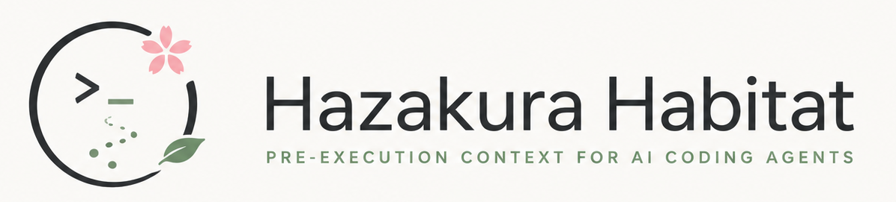

# Hazakura Habitat

<p align="center">
  
</p>

Hazakura Habitat is a macOS-first SwiftPM CLI for developers using AI coding agents.

Run it before an agent starts work. It generates short, advisory project context that tells the agent which tools to prefer, which commands require approval, and which secret-bearing paths to avoid.

It does not execute, approve, block, or sandbox commands.

Status: `v0.8.0 Developer Preview` - advisory only - no command enforcement - macOS-first.

## AI Agent Entry Point

If you are an AI coding agent reading this repository, start with the bundled
skill:

- [Agent Skill](skills/hazakura-habitat/SKILL.md)
- Install command: `npx skills add lero003/hazakura-habitat@hazakura-habitat -g`

Use the skill before substantial project work, dependency or lockfile changes,
Git/GitHub mutations, unfamiliar-repo onboarding, or secret-adjacent operations.
The skill explains when to run Habitat, which generated file to read first, and
how to proceed if `habitat-scan` is not installed yet.

For partial adoption in an existing repository, see
[AI Agent Adoption Guide](docs/adoption_guide.md). Habitat can be used as a
small pre-work context layer without replacing existing `README.md`,
`AGENTS.md`, changelogs, roadmaps, or project development docs.

The MVP is not a human dashboard. It is a pre-work contract for AI agents: a map before the agent walks, not a fence around the agent.

Hazakura Habitat does not make an AI coding agent safe by itself. It only generates advisory context that an agent or user may choose to follow.

## What This Is Not

Hazakura Habitat is not:

- a local environment dashboard
- a package manager inventory
- a security scanner
- a sandbox
- a secret scanner
- an OS-level command enforcement tool

It does not enforce commands. It generates conservative pre-execution context for AI coding agents.

In generated policy, `Forbidden` means "the generated context tells the agent not to run this." It is advisory guidance, not an operating-system-level block.

## Positioning

Hazakura Habitat is not an AI coding agent, sandbox, or runtime security monitor.

It does not execute, approve, or block commands.

Instead, it generates short, conservative, project-derived context before an AI coding agent starts working. The goal is to help agents choose better commands, avoid risky defaults, and ask before mutating dependencies or touching sensitive files.

Habitat is designed to complement tools such as Codex CLI, Claude Code, OpenCode, Cline, Goose, and sandboxed development environments.

## Typical Use

1. Run Habitat before asking an AI coding agent to work on a project.
2. Give the generated `agent_context.md` to the agent.
3. Use `command_policy.md` when the agent needs fuller guidance on allowed, Ask First, and Forbidden commands.
4. Treat all output as advisory context. Habitat does not configure, approve, deny, or block commands for any agent automatically.

## Agent Skill

For AI-first workflows, the preferred entrypoint is the bundled agent skill:

```bash
npx skills add lero003/hazakura-habitat@hazakura-habitat -g
```

The skill teaches an AI coding agent to run Habitat before substantial project work, dependency or lockfile changes, Git/GitHub mutations, and secret-adjacent operations. It also gives the agent a conservative setup path when `habitat-scan` is not installed yet.

The skill lives at [skills/hazakura-habitat](skills/hazakura-habitat).

## Core Bet

AI agents do not need a beautiful inventory of everything installed on a machine. They need a short, current, structured answer to:

- Which tools should I use for this project?
- Which tools or commands should I avoid?
- Are the active runtimes inconsistent with project files?
- Should I execute a command now, ask first, or refuse?

## Product Principles

1. Command decisions over environment inventory.
2. Project-local signals over global machine state.
3. Conservative guidance over automatic mutation.
4. Secret presence over secret contents.
5. Short agent context over exhaustive reports.

Hazakura Habitat is developed around output quality, not feature breadth. The published `v0.8` Developer Preview is the shipped Observation -> Action hardening release: it improves previous-scan comparison, report freshness signals, preferred-command deltas, generated context traceability, and skill-helper reliability while preserving the advisory, read-only boundary. Current main-branch work is `v0.9` Pre-1.0 hardening: sorting which contracts can become stable for v1, which metadata remains preview, and which guidance should stay docs-only.

The roadmap now prioritizes:

1. Pre-1.0 stability boundaries (v0.9)
2. Stable advisory generator scope (v1.0)
3. Post-v1 expansion only when repeated command-decision or release-trust evidence justifies it

The goal is not to inspect everything on the machine. The goal is to generate concise, conservative context that changes an AI coding agent's next command choice.

Habitat is meant to complement `AGENTS.md` and project docs, not duplicate them. Its value is strongest when it surfaces current repository facts, risky command boundaries, or instruction drift that written guidance alone does not prove. If project docs already answer the command question for a low-risk task, skipping Habitat is acceptable.

## Development Model

Hazakura Habitat is an AI-first developer tool.

It is designed for AI coding agents, and it is also developed with AI coding agents. That is intentional: the project treats AI not as an add-on, but as a primary development participant.

The goal is to make AI-led development more legible and more conservative before commands are executed.

## Open Source Intent

Hazakura Habitat is meant to share an idea as much as an implementation.

If the project helps other tools, developers, or agents adopt better pre-execution context, that is success. Forks, reimplementations, and projects that take the underlying ideas further are welcome.

The goal is not to own this category. The goal is to help the AI-first development ecosystem become more legible and more conservative before commands run.

Credit, citations, or special thanks are warmly appreciated when this project or its ideas help your work, but the license only requires preserving the copyright and license notice.

## MVP Outputs

The primary outputs are:

- `scan_result.json`: machine-readable scan data
- `agent_context.md`: short AI-facing project/environment context
- `command_policy.md`: allowed, approval-required, and forbidden command guidance

The secondary output is:

- `environment_report.md`: longer audit/debug report for humans and AI when more detail is needed

The MVP does not generate separate `env_changes.md` or `project_dependency_summary.md`; their useful parts are folded into `agent_context.md` and `command_policy.md`.

In `v0.x`, `scan_result.json` is preview metadata for audit, debug, and tooling use. Its top-level purpose is stable, but individual fields may change before `v1.0`. Agent-facing guidance should start with `agent_context.md`; use `scan_result.json` for generated artifact metadata including report-relative path, agent reading role, read trigger, read order, entry section, entry line, section heading line index, line and character counts, budget status for line-limited outputs, key observed project-file modification times and latest observed file metadata for freshness checks, machine-readable policy `reasonCodes`, command counts including Review First size, top-priority `reviewFirstCommandReasons`, and per-command `commandReasons`.

## Privacy and Prompt-Injection Stance

Hazakura Habitat detects the presence of secret-bearing files, not their values. It should not read, collect, or emit `.env` values, package-registry tokens, SSH private keys, local cloud/container credential values, shell history, clipboard contents, browser data, or mail data.

Tests may contain dummy secret-like strings to verify non-emission behavior. They are not real credentials.

Generated AI-facing Markdown should treat project-derived strings as untrusted data. Prefer normalized signals over raw project text, and do not include arbitrary project file contents in `agent_context.md`.

Runtime version hints from `.nvmrc`, `.node-version`, `.python-version`, `.ruby-version`, `.tool-versions`, `mise.toml`, and `.mise.toml` are only emitted when their values are short, version-like strings. Oversized or suspicious values are reported by filename only and cause dependency installs to require verification first. Suspicious package-manager version metadata from `package.json`, `.tool-versions`, `mise.toml`, or `.mise.toml` is reported by field name only, without emitting the value.

## Start Here

For new users:

- [Current Status](docs/current_status.md)
- [Roadmap](docs/roadmap.md)
- [Known Limitations](docs/known_limitations.md)
- [Distribution Foundations](docs/distribution_foundations.md)

For AI agents and automation:

- [Agent Skill](skills/hazakura-habitat/SKILL.md)
- [Agent Contract](docs/agent_contract.md)
- [AI Agent Adoption Guide](docs/adoption_guide.md)
- [Evaluation](docs/evaluation.md)
- [Development Loop](docs/development_loop.md)
- [Self-Use Loop](docs/self_use.md)

For project context and contribution:

- [Product Direction](docs/product_direction.md)
- [MVP Plan](docs/mvp_plan.md)
- [Positioning](docs/positioning.md)
- [Public Readiness](docs/public_readiness.md) - historical first-public audit trail
- [GitHub Workflow](docs/github_workflow.md)
- [Contributing](CONTRIBUTING.md)
- [ADR 0001](docs/adr/0001-ai-first-core-cli.md)
- [ADR 0002](docs/adr/0002-agent-safe-secret-handling.md)

## Current Status

The repository contains the `v0.8.0 Developer Preview` implementation of the AI-first CLI. See [Current Status](docs/current_status.md) for what is implemented and what should come next.

See [Public Readiness](docs/public_readiness.md) for the completed `v0.1.0` publication checklist and scope boundaries.

## Requirements

- macOS 13 or later.
- Swift 6.1 toolchain or a compatible Xcode toolchain.

## Install From Release

For the short decision guide covering source checkouts, verified local binaries,
direct stdout artifacts, and downloaded release directories, see
[Distribution Foundations](docs/distribution_foundations.md).

Download `habitat-scan-macos.zip`, `habitat-scan`, and `SHA256SUMS` from the latest Developer Preview GitHub Release, keep them in the same directory, then verify checksums before running the downloaded binary:

```bash
shasum -c SHA256SUMS
unzip habitat-scan-macos.zip
./dist/habitat-scan --version
./dist/habitat-scan scan --project . --output ./habitat-report
```

`SHA256SUMS` is published alongside the generated release assets. Treat checksum verification as the first trust step for release consumption. If `shasum -c SHA256SUMS` fails, or if a release asset is missing from `SHA256SUMS`, do not run the downloaded binary.

The zip path is the recommended run path. The standalone `habitat-scan` asset is included so `SHA256SUMS` can verify every generated release artifact.

For automation and agent workflows, also compare the binary version with the generated report metadata before depending on a saved report:

```bash
./dist/habitat-scan --version
./dist/habitat-scan scan --project . --output ./habitat-report
grep '"generatorVersion"' habitat-report/scan_result.json
```

The `--version` output identifies the binary. The top-level `generatorVersion` in `scan_result.json` identifies the generator that produced the report. If either value is not the release you meant to consume, refresh the binary or report before using `agent_context.md` for command decisions.

For local scripts that only need this metadata check, use the bundled helper
with a verified binary path:

```bash
scripts/check_habitat_metadata.sh ./dist/habitat-scan . 0.8.0
```

The helper reads `scan_result.json` through `--stdout scan-result`, compares
`generatorVersion` with `habitat-scan --version`, verifies that
`schemaVersion` is the helper's expected preview schema, verifies the generated
Markdown artifact metadata for `agent_context.md`, `command_policy.md`, and
`environment_report.md` includes the expected names, roles, relative paths,
formats, read order, read triggers, and agent-use hints, checks that
`--stdout agent-context`, `--stdout command-policy`, and
`--stdout environment-report` return the expected Markdown artifacts,
and leaves `habitat-report/` untouched.
It also checks the matching `--stdout` filename aliases, so scripts can use
artifact names read from metadata without translating them back to CLI tokens.
The CLI and print helper also accept those filenames with a leading `./`, which
keeps report-relative path handling simple for metadata-driven scripts.
Successful output includes `binaryVersion`, `schemaVersion`, and
`generatorVersion` lines for script logs.

For downloaded release directories, use the release verification helper before
any script depends on the binary:

```bash
scripts/verify_habitat_release.sh /path/to/downloaded-release . 0.8.0
```

The helper runs `shasum -c SHA256SUMS` first, extracts
`habitat-scan-macos.zip` into a temporary directory when that asset is present,
and then delegates to `check_habitat_metadata.sh`. It does not install Habitat,
edit shell startup files, or create `habitat-report/`. It also rejects
`SHA256SUMS` entries that use absolute paths or parent-directory segments before
running `shasum`, rejects a selected zip or standalone asset that is missing
from `SHA256SUMS`, and rejects zip entries that would extract outside the
temporary directory. The verified `habitat-scan` path must be a regular
executable, not a symlink, so verification stays scoped to the downloaded
release directory and its temporary extraction path.

For local scripts that need one verified artifact on stdout, use the matching
print helper. Verification failures go to stderr, so stdout remains the
requested artifact:

```bash
scripts/print_habitat_artifact.sh ./dist/habitat-scan . agent_context.md 0.8.0
scripts/print_habitat_artifact.sh ./dist/habitat-scan . command_policy.md 0.8.0
scripts/print_habitat_artifact.sh ./dist/habitat-scan . habitat-report/agent_context.md 0.8.0
scripts/print_habitat_artifact.sh ./dist/habitat-scan . /path/to/project/habitat-report/agent_context.md 0.8.0
```

This helper verifies the binary version, `generatorVersion`, expected preview
`schemaVersion`, and requested artifact metadata before printing. For Markdown
artifacts, that metadata includes the expected role, path, format, read order,
read trigger, and agent-use hint. It does not create or update
`habitat-report/`. The `habitat-report/filename` and absolute saved-report
forms are accepted only when `habitat-report` is a real path component followed
by the artifact filename; they still print a direct stdout artifact rather than
reading a saved report file.

For downloaded release directories, use the release print helper when a script
needs a verified artifact from the zip or standalone release asset without
managing the extracted binary path:

```bash
scripts/print_habitat_release_artifact.sh /path/to/downloaded-release . agent_context.md 0.8.0
scripts/print_habitat_release_artifact.sh /path/to/downloaded-release . habitat-report/agent_context.md 0.8.0
```

This helper keeps the same checksum-first release boundary, writes verification
output to stderr, delegates artifact metadata checks to the print helper, and
keeps stdout limited to the requested artifact. It accepts the same
report-filename and saved-report path aliases as the local print helper while
still regenerating the requested stdout artifact from the verified binary.

## Run

```bash
swift build
./.build/debug/habitat-scan scan --project . --output ./habitat-report
```

For automation and local scripts that only need the short working context, full
command policy, diagnostics, or machine-readable scan result, print that
artifact directly instead of creating a report directory:

```bash
./.build/debug/habitat-scan scan --project . --stdout scan-result
./.build/debug/habitat-scan scan --project . --stdout agent-context
./.build/debug/habitat-scan scan --project . --stdout command-policy
./.build/debug/habitat-scan scan --project . --stdout environment-report
./.build/debug/habitat-scan scan --help
```

`--stdout` keeps stdout limited to the requested artifact. It accepts the
artifact tokens above or the matching generated report filenames:
`scan_result.json`, `agent_context.md`, `command_policy.md`, and
`environment_report.md`, including `./filename`, `habitat-report/filename`, and
absolute saved-report paths where `habitat-report` is a real path component. Use
`--output` when you need durable report files; do not combine `--stdout` and
`--output` in one scan command.
Use `scan --help` for scan-specific output and file-consumption forms.

Optional comparison against a previous scan:

```bash
./.build/debug/habitat-scan scan --project . --output ./habitat-report --previous-scan ./old-habitat-report
```

`--previous-scan` accepts either a previous report directory or a direct `scan_result.json` path.

Generated files:

- `habitat-report/scan_result.json`
- `habitat-report/agent_context.md`
- `habitat-report/command_policy.md`
- `habitat-report/environment_report.md`

## Exit Codes

- `0`: scan completed and artifacts were written.
- non-zero: CLI argument error, output write failure, or fatal scan setup error.
- Missing tools are usually represented as scan data, not fatal errors.

## Example Output

See [examples](examples/README.md) for representative output shapes.

## GitHub

This project is backed by `lero003/hazakura-habitat`. See [GitHub Workflow](docs/github_workflow.md) for commit, CI, and artifact release conventions.

Manual artifact build:

```bash
./scripts/build_release_artifacts.sh
```

This writes local artifacts under `dist/`, including `SHA256SUMS` for release verification.

## License

Hazakura Habitat is released under the [MIT License](LICENSE).
